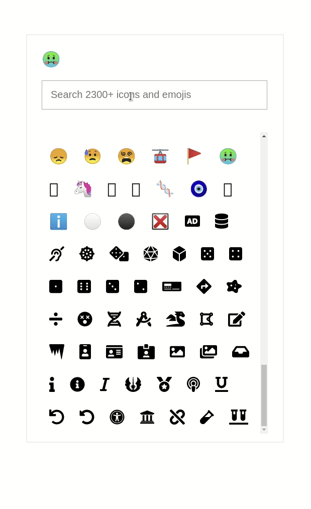

## Available Scripts

In the project directory, you can run:

### `yarn start`

Runs the app in the development mode. 
Open [http://localhost:3000](http://localhost:3000) to view it in the browser.

The page will reload if you make edits. 
You will also see any lint errors in the console.

### `yarn build`

Builds the app for production to the `build` folder. 
It correctly bundles React in production mode and optimizes the build for the best performance.

The build is minified and the filenames include the hashes. 
Your app is ready to be deployed!

See the section about [deployment](https://facebook.github.io/create-react-app/docs/deployment) for more information.

### TODO

At any point we may want to refactor the code at our discretion

- [ ] Filter out unavailable emojis
- [ ] Improve relevance of the search
- [ ] Create a new component (EmojiIconSelector) which has a placeholder grayed out icon
  - On-click of placeholder icon, a popup opens in which we have the following features
    - A search field to search for an emoji or icon
    - A default list of icons and emojis each grouped vertically with group names ("Emojis", "Icons")
    - On searching for keywords, the list of icons and emojis filters to show only the relevant icons and emojis
    - A clear icon/button to clear the search keyword
    - A clear icon/button to clear the selected icon/emoji
  - On click of any of the emojis or icons in the list, the placeholder icon is replaced with the selected icon
- [ ] Create a way for the user to upload an image of their choice as an icon
  - The uploaded icon can be stored in localStorage. Use of `redux-sagas` is recommended.
  - An uploading indicator, error in upload indicator and successful upload status indicator can be added as features.
  - The uploaded icon can be listed at the top in the popup under the group of "uploaded icons"
  - The uploaded icon can be stored in a redux store to avoid the need to load from localstorage everytime.
- [ ] Include `redux-form` and create a `Field` component which wraps the EmojiIconSelector
- [ ] Add jest unit tests.
